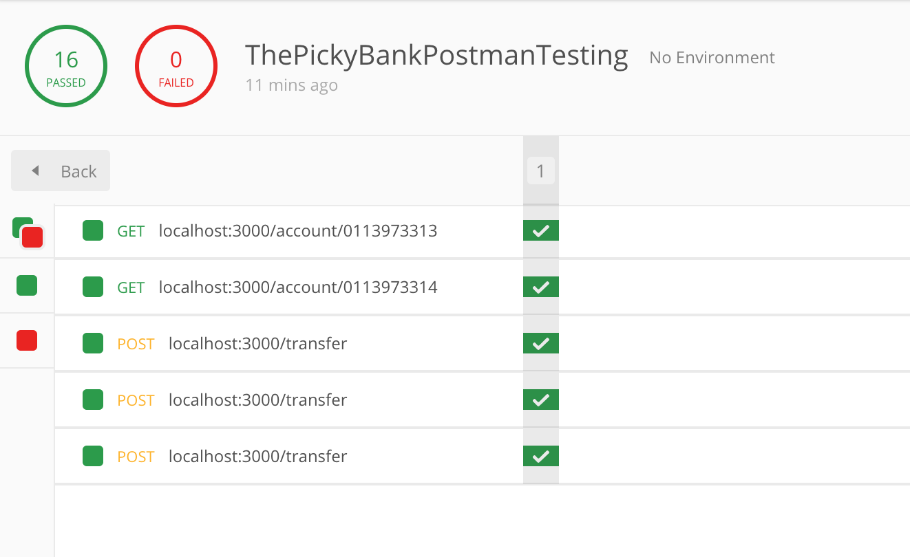
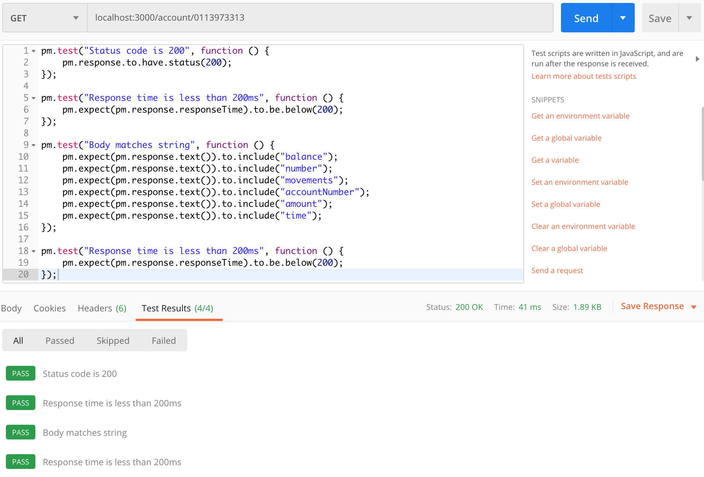
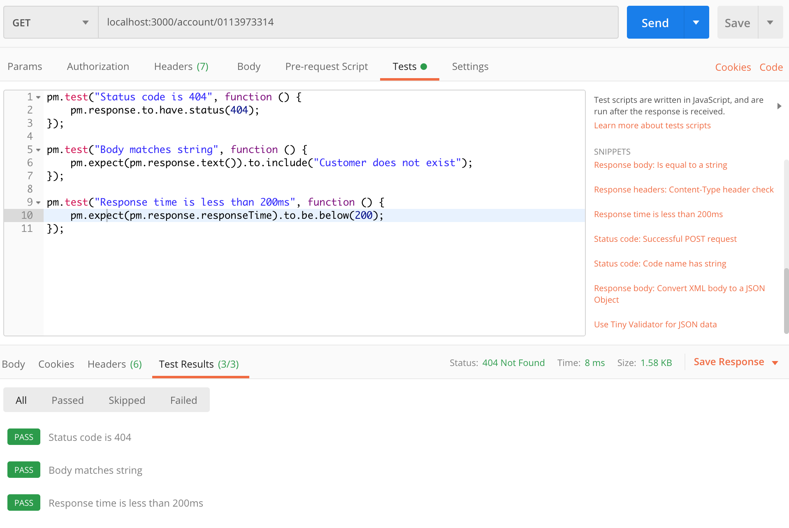
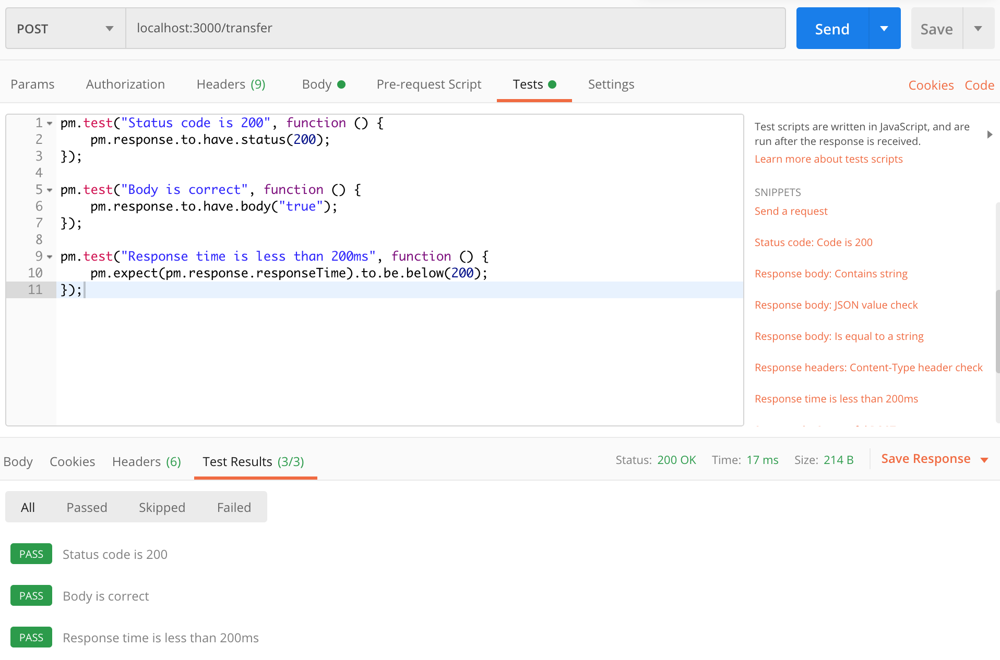
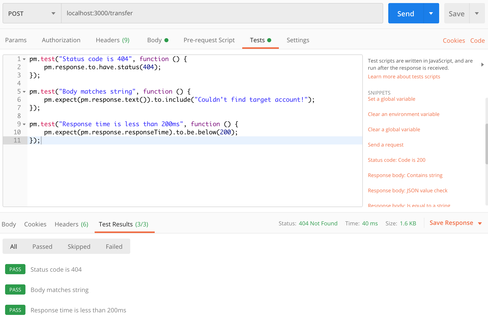
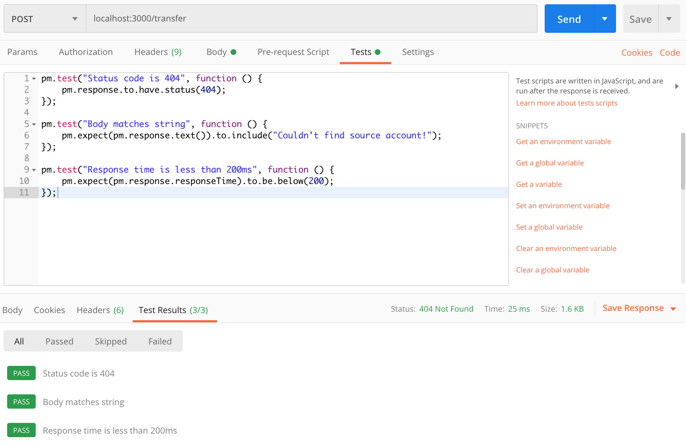

# Assignment 4 - REST API Test
### The well-tested bank
___

### Group members:

- Adam Lass
- Rasmus Helsgaun
- Pernille Lørup

____ 

### REST API 

In this assignment we were to make a REST API that uses the contract. 

Therefore we decided to make an Express server using Typescript. We made the decision to use Postman's testing tool to test our REST API. 

For the REST API the Typescript files listed below are the most 'important' for this assignment. 

[Contract.ts](implementations/Contract.ts) - Contains two contract methods.

[BankError.ts](error/BankError.ts) - Error to be thrown in the Contract.

[index.ts](index.ts) - The main file containing the test data and the Express API. 

____

### Postman Testing

As mentioned earlier, we decided to write our tests in Postman which can be downloaded from our folder [here](postmanTest). The JSON file in the folder can be imported as a collection inside Postman. When running each individual endpoint, you also run the associated tests. These will be shown in the tab called 'Tests'. 

If you can't run the tests, we have included some screenshots below.

### Attachments

This is an overview of the passing tests:

The first is our getAccountFromCPR()
We have written three tests for this:

* That the status code is 200
* That the response time is less than 200 ms
* That the response contains the given strings
* Just ignore the fourth :D 

The second is our getAccountFromCPR() but with a non-existing CPR-number

The third is our transfer()

The fourth is our transfer() but with a non existing target account

The fifth is our transfer() but with a non existing source account

